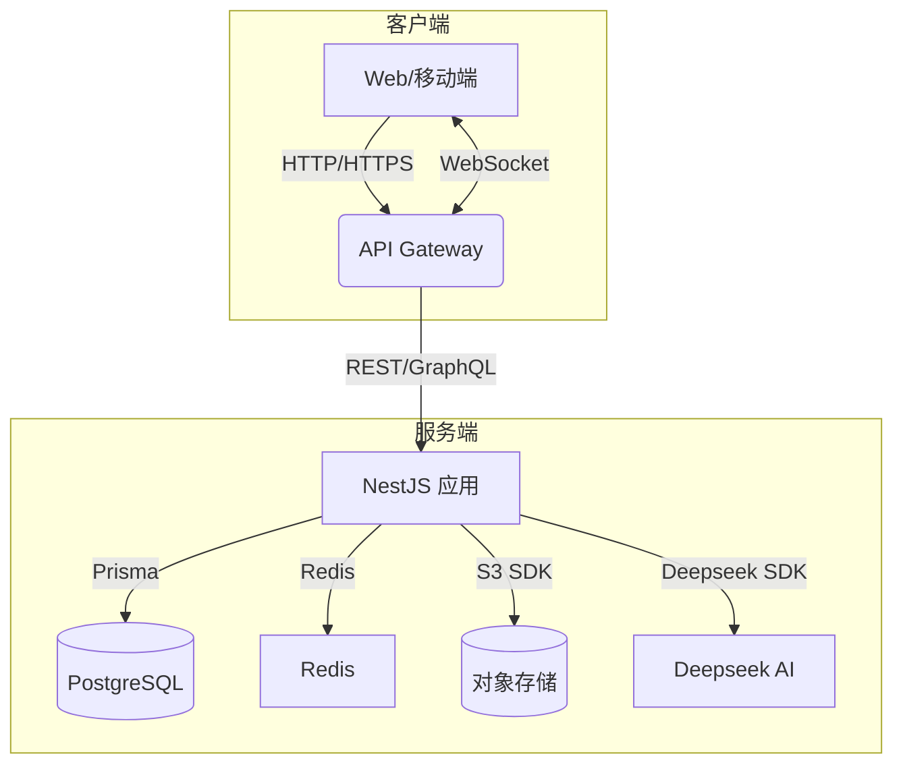

我希望能开发一个物理题刷题网站，逻辑参考学而思或者猿辅导，用于学生的课后练习，具体要求如下：
1.每个学生、老师都可以注册自己的账号，除保存个人信息外，学生账号还保存当下学习、刷题进度、错题，老师账号能够查看自己所负责班级学生做题情况和进度
2.调用deepseek API,根据学生当下做题情况和整体情况，进行智能提醒和学习规划 (**注意：API-KEY 已移除，将通过安全的环境变量进行管理**)
3.题目范围为初中物理，题库按照章节划分，学生可以自行选择乱序刷题还是重点章节针对性训练
4.分为学生端口和教师端口，学生端口主要用于做题，老师端口则用于查看学生学习情况，也能通过上传word文件更新新的题目，

## 5. 技术栈与框架选择

| 层次 | 技术/框架 | 选择理由 |
| --- | --- | --- |
| 前端 | Next.js（React 18 + TypeScript） | 1) 服务器端渲染 (SSR) 兼顾 SEO 与首屏性能；2) 支持文件路由与 App Router 提升开发效率；3) 与 React 生态高度兼容，社区成熟。
| 移动端 | React Native Expo | 代码复用率高，可快速发布 iOS/Android 客户端。
| UI 组件 | Ant Design + Tailwind CSS | Ant Design 提供成熟的企业级组件，Tailwind 负责原子级样式快速迭代；二者结合保证 UI 统一且灵活。
| 状态管理 | Redux Toolkit + RTK Query | 统一管理全局状态，RTK Query 内置数据缓存、请求状态与并发处理，简化 API 调用逻辑。
| 后端 | NestJS（Node.js + TypeScript） | 1) 类 SpringBoot 架构，模块化清晰；2) 内置依赖注入、拦截器、管道等特性，易于扩展；3) 与 TypeScript 深度集成，类型安全。
| 数据库 | PostgreSQL + Prisma ORM | PostgreSQL 支持关系与 JSONB 复合数据；Prisma 提供强类型 ORM 与迁移工具，提升开发效率。
| 缓存 | Redis | 存储会话、排行榜及高频查询，降低数据库压力。
| 文件存储 | AWS S3 (或阿里 OSS/腾讯 COS) | 存储题目图片、解析等静态资源，支持 CDN 加速。
| AI 服务 | Deepseek API | 提供个性化学习规划与智能提醒。
| 日志 | Winston + Elasticsearch + Kibana (ELK) | Winston 本地日志，输出到 Elasticsearch，Kibana 可视化查询；按需设置 info、warn、error 等等级。
| CI/CD | GitHub Actions + Docker + K8s | 自动化测试、构建并部署到 Kubernetes，实现弹性伸缩。

## 6. 系统架构

- **API Gateway**：可直接由 NestJS 充当或使用 Nginx / Kong，根据后期需求决定。
- **WebSocket**：用于实时推送智能提醒、做题进度等。

## 7. 功能模块划分（后端）

1. **Auth 模块**：
   - JWT + Refresh Token 认证；
   - 支持邮箱/手机号注册登录；
   - 基于角色 (Student/Teacher/Admin) 的权限控制。
2. **User 模块**：
   - 学生信息、学习进度、错题本；
   - 老师信息、班级管理。
3. **QuestionBank 模块**：
   - 题库 CRUD & 导入（解析 Word -> HTML/Markdown -> 题目 JSON）；
   - 章节/难度/知识点标签管理。
4. **Exercise 模块**：
   - 提供随机/定向出题接口；
   - 记录学生答题记录、用时与正确率。
5. **Analytics 模块**：
   - 聚合学生/班级维度做题数据；
   - Teacher 端可查看报表 (ECharts)。
6. **AI Planner 模块**：
   - 与 Deepseek API 交互，根据学生表现生成学习计划；
   - 推送提醒任务 (Cron + WebSocket/推送通知)。
7. **FileUpload 模块**：
   - 老师上传 Word；后端使用 LibreOffice/第三方服务转 HTML -> 题库。
   
## 8. 非功能需求

- **性能**：常见接口 P99 < 300 ms；峰值并发万级支持。
- **安全**：OWASP Top10 防护；使用 Helmet、CSRF、Rate Limit。
- **可维护性**：代码覆盖率 ≥ 80%；遵循 ESLint & Prettier。
- **可观察性**：全链路日志、Prometheus 指标、Grafana 监控。

## 9. 里程碑计划

| 阶段 | 时长 | 关键交付物 |
| --- | --- | --- |
| 需求评审 & 原型设计 | 1 周 | 完成原型图、ER 图、接口契约 |
| 核心功能开发 (Auth、QuestionBank) | 3 周 | 可登录、导入题库、学生刷题 |
| AI Planner & Analytics | 2 周 | 个性化计划、报表可视化 |
| 测试 & 调优 | 1 周 | 完成集成测试、性能测试 |
| 上线 & 监控 | 1 周 | Docker 镜像、K8s 部署、监控告警 |

> **备注**：以上技术栈在 Node.js/TypeScript 生态中广泛应用，可满足快速迭代、可维护与高性能需求；如需 Java 或 Go 方案，可进一步讨论。